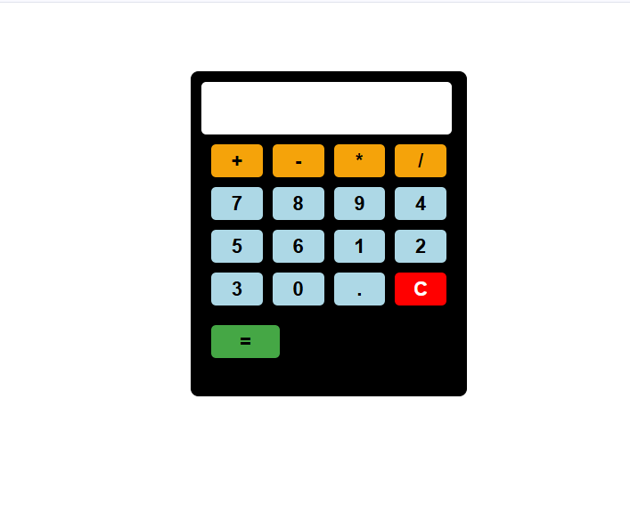

# Simple Calculator

This is a simple and responsive **Calculator** web application built using **HTML, CSS, and JavaScript**.

## Features
- User can enter numbers  
- Perform basic arithmetic operations: **Addition, Subtraction, Multiplication, Division**  
- Clear input with a **C** button  
- Displays calculation result instantly  
- Responsive design for desktop and mobile  

## Technologies Used
- HTML  
- CSS  
- JavaScript  

## Screenshots
  

## Live Demo
You can view the live demo of the project here:  
👉 https://neelima-vallapuneni.github.io/Simple-Calculator/

## How to Run
1. Download the project files.  
2. Open `index.html` in your browser.  

## Future Enhancements
- Add keyboard input support  
- Add scientific calculator features (sin, cos, tan, etc.)  
- Add calculation history  
- Enhance UI with themes and animations  

## Author
Neelima Vallapuneni

